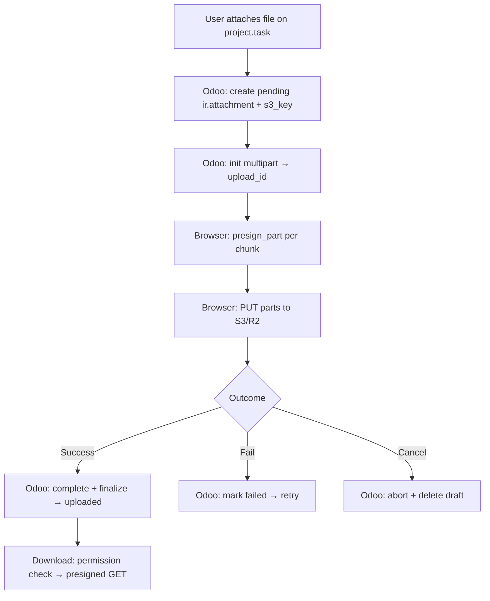

# PRD: S3-Compatible Task Attachments for `project.task`

**Status:** Draft  
**Last updated:** 2026-06-05  
**Product:** Odoo 19 custom module  
**Environment:** Docker (`odoo:19`), fresh install, no legacy attachments  
**Business context:** Publishing/editing company — editors submit PDFs, Word documents, images, and Figma files via project tasks  

---

## Problem Statement

Editors deliver large creative files through Odoo project tasks. Storing those files in Odoo's local filestore does not scale well for size, cost, or operations. The team needs task-linked attachments stored in **S3-compatible object storage** (AWS S3 or Cloudflare R2), with uploads going **directly from the browser to storage** after Odoo authorizes them — without Odoo proxying file bytes.

---

## Solution

A custom Odoo module that:

1. Intercepts **all** attachment creation for `project.task` (chatter, form, RPC — every path).
2. Creates a **draft** `ir.attachment` with a reserved storage path and status `pending`.
3. Orchestrates **multipart upload** via thin RPC (`init` → `presign_part` → `complete` / `abort`).
4. Lets the **browser upload directly** to S3/R2; Odoo never handles file bytes during transfer.
5. Finalizes the attachment on success; handles **failed** (retryable) and **cancelled** (removed) states.
6. Serves downloads via **permission-checked presigned GET** URLs for internal Odoo users only.

---

## User Stories

### Editors / production staff

1. As an **editor**, I want to attach a deliverable to a project task, so that my submission is linked to the correct job.
2. As an **editor**, I want to upload **large files** without an artificial size cap, so that print PDFs and Figma exports are supported.
3. As an **editor**, I want to see **upload progress** while my file transfers, so that I know the submission is working.
4. As an **editor**, I want a **clear error message** when an upload fails, so that I know what to do next.
5. As an **editor**, I want to **retry** a failed upload without re-selecting the file, so that flaky networks don't block delivery.
6. As an **editor**, I want to **cancel** an in-progress upload, so that mistaken uploads don't clutter the task.
7. As an **editor**, I want to **download** a teammate's attachment from the task, so that I can review their work.
8. As an **editor**, I want to attach **PDF, Word, image, and Figma** files, so that all standard deliverable types work.
9. As an **editor**, I want uploads to work from **chatter and any task attachment UI**, so that I'm not blocked by which button I use.

### Project managers

10. As a **project manager**, I want attachments on tasks I can access to follow **normal project permissions**, so that security stays familiar.
11. As a **project manager**, I want to see which uploads **failed or are pending**, so that I can chase incomplete submissions.

### Administrators

12. As an **admin**, I want to configure **bucket, region, endpoint URL, and key prefix** in Odoo Settings, so that I can point at S3 or R2 without code changes.
13. As an **admin**, I want **AWS/R2 credentials** supplied via **environment variables**, so that secrets aren't stored in the database.
14. As an **admin**, I want to configure **presigned URL TTL**, so that I can balance security vs. long uploads.
15. As an **admin**, I want a **connection test** in Settings, so that I can verify storage config before editors upload.
16. As an **admin**, I want **logs** when presign or storage operations fail, so that I can troubleshoot production issues.

### System / integration

17. As the **system**, I want to **reject** local binary uploads on `project.task` attachments that bypass the S3 flow, so that storage policy is enforced consistently.
18. As the **system**, I want attachments stored at `projects/{project_id}/tasks/{task_id}/{uuid}_{filename}`, so that objects are organized by job structure.
19. As the **system**, I want **no local filestore copy** for S3-backed attachments, so that S3/R2 is the single source of truth.
20. As the **system**, I want to **abort** incomplete multipart uploads when a user cancels, so that orphan parts don't accumulate cost.
21. As the **system**, I want presigned part URLs to be **refreshable** on expiry, so that long multipart uploads can complete.

---

## Implementation Decisions

### Architectural decisions

| Decision | Choice |
|----------|--------|
| Backend | Odoo module (controllers + models) |
| Scope | Any `ir.attachment` where `res_model = 'project.task'` |
| Storage | S3-compatible (AWS S3 **or** Cloudflare R2) |
| Storage model | S3/R2 only — metadata in Odoo, no local `datas` |
| S3 key layout | `projects/{project_id}/tasks/{task_id}/{uuid}_{filename}` |
| Bucket strategy | Single bucket (v1) |
| File types | Blocklist dangerous extensions (`.exe`, `.bat`, etc.); accept creative formats |
| Upload flow | Draft-first optimistic: pending record → multipart upload → finalize |
| On success | Mark attachment `uploaded` |
| On failure | Keep draft, status `failed`, allow retry |
| On cancel | Delete draft; abort multipart on storage |
| Retry | Reuse key if no object exists; new key if partial object exists |
| Download | Presigned GET after Odoo permission check |
| Config | Hybrid: credentials from env; bucket/region/endpoint/prefix/TTL in Settings |
| Permissions | Standard Odoo project security |
| Legacy data | None — greenfield |
| Upload UI | All paths that create task attachments |
| Non-browser uploads | Reject local binary in v1 |
| Multipart | Yes — Odoo orchestrates, browser transfers |
| Presigned TTL | Configurable, default 1 hour |
| v1 bar | Core loop + admin settings + progress/errors/logging |
| External access | Internal Odoo users only |

### Proposed modules

| Module | Responsibility | Interface (conceptual) |
|--------|----------------|------------------------|
| **Storage client** | S3-compatible ops via configurable `endpoint_url` | `init_multipart`, `presign_part`, `complete_multipart`, `abort_multipart`, `head_object`, `presign_get` |
| **Attachment lifecycle** | Draft/finalize/fail/cancel on `ir.attachment` | `create_pending`, `mark_uploaded`, `mark_failed`, `cancel`, `resolve_retry_key` |
| **Upload RPC API** | HTTP/JSON routes for browser | `POST /s3_upload/init`, `presign_part`, `complete`, `abort`, `finalize_attachment` |
| **Download broker** | Permission check + presigned GET | `get_download_url(attachment_id)` |
| **Attachment guard** | Block local binary on `project.task` | Override `ir.attachment` `create`/`write` |
| **Settings** | `res.config.settings` extension | endpoint, bucket, region, prefix, TTL, blocklist, test connection |
| **Frontend patch** | Chatter + attachment widgets for `project.task` | Multipart uploader with progress, retry, cancel |

### Schema changes (`ir.attachment` extension)

| Field | Purpose |
|-------|---------|
| `s3_storage_status` | `pending` \| `uploaded` \| `failed` \| `cancelled` |
| `s3_bucket` | Bucket name |
| `s3_key` | Object key |
| `s3_upload_id` | Multipart upload ID (while pending) |
| `s3_etag` | Optional; set on complete |
| `storage_provider` | `s3` \| `r2` (informational) |
| `file_size` | Bytes (from client or HEAD) |
| `mimetype` | Standard |

`datas` / `raw` must remain empty for S3-backed task attachments.

### Upload API contract (browser ↔ Odoo)

```
1. create_pending(task_id, filename, mimetype, size) → attachment_id, s3_key
2. init(attachment_id) → upload_id
3. presign_part(attachment_id, upload_id, part_number) → presigned_url
   (repeat per part; refresh on expiry)
4. Browser PUTs parts directly to storage
5. complete(attachment_id, upload_id, parts[{part_number, etag}]) → Odoo completes multipart
6. finalize(attachment_id) → status = uploaded

On error:  fail(attachment_id, reason) → status = failed
On cancel: cancel(attachment_id) → abort multipart, delete draft
On retry:  resolve key (reuse vs rotate) → back to step 2
```

Odoo does **not** receive file bytes at any step.

### Download flow

1. User clicks attachment on task.
2. Odoo checks standard project/attachment access.
3. Odoo returns short-lived presigned GET URL.
4. Browser fetches directly from S3/R2.

### Configuration

**Environment (secrets):**

- `S3_ACCESS_KEY_ID`
- `S3_SECRET_ACCESS_KEY`
- Optional: `S3_SESSION_TOKEN`

**Odoo Settings (non-secret):**

- `endpoint_url` (blank = AWS default; set for R2)
- `bucket_name`
- `region`
- `key_prefix` (optional org-wide prefix)
- `presigned_url_ttl_seconds` (default 3600)
- `use_path_style` (if needed for R2/MinIO)
- Blocklist extensions

**Odoo module dependencies:** `project`, `mail`  
**Python dependencies:** `boto3` (or compatible S3 client)

### Upload flow diagram



---

## Testing Decisions

**Principle:** Test observable behavior, not internals — mock the storage client at the module boundary.

| Area | What to test |
|------|----------------|
| **Storage client** | Init/presign/complete/abort called with correct params; R2 endpoint URL passed through |
| **Attachment guard** | `create` with `datas` on `project.task` → rejected; S3 metadata path → allowed |
| **Lifecycle** | pending → uploaded; pending → failed (retryable); pending → cancelled (deleted) |
| **Retry logic** | No object → same key; partial object → new key |
| **Download broker** | Denied without access; presigned GET returned with access |
| **Blocklist** | `.exe` rejected at pending create |

**Recommended minimum automated test coverage:** storage client, attachment guard, lifecycle/retry.

**Not required for v1:** Full browser E2E; load tests on multipart. Manual QA on large files in staging.

---

## Out of Scope (v1)

- Portal / external customer download
- Public or semi-public share links
- Per-project or per-client buckets
- AWS Transfer Acceleration (AWS-only; N/A for R2)
- Migration of existing local attachments
- Server-side fallback upload (email-to-task, API with raw bytes)
- Multipart upload metrics / dashboards
- Automated orphan multipart cleanup (v1.1)
- Full automated E2E browser tests
- File preview generation (PDF thumbnail, etc.)
- Attachments on models other than `project.task`

---

## Further Notes

### Provider portability (S3 vs R2)

Design around the **S3 API** with configurable `endpoint_url`. R2 uses the same presign/multipart flow; avoid AWS-only features in v1. Validate against one provider in dev first; smoke-test the other before production.

### Interview refinements

- Initial plan to patch chatter JS only was superseded by **all attachment paths** — a server guard on `ir.attachment` is required, not chatter JS alone.
- Initial single PUT approach was superseded by **multipart upload** for large publishing files.

### Suggested module name

`project_task_s3_attachment` or `task_s3_storage` — confirm before scaffolding.

### Open items for implementation kickoff

1. Exact blocklist extensions
2. Default multipart part size (e.g. 8–64 MB)
3. Which provider to use first in dev (S3 or R2)
4. Final module name
